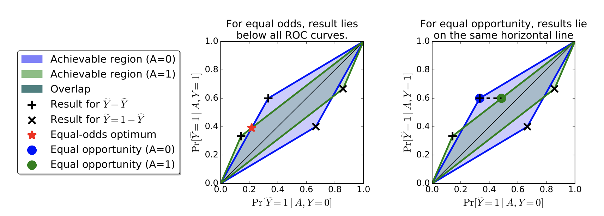

# Fairness

**Why do we care?**

> Nowadays, many things have automated by ML systems. For instance, companies use ML system to help them select job applicants; courts in US use ML algorithm for recidivism prediction; Amazon, Netflix use recommender system...
>
> We care about fairness because it is highly related to our own benefits. 

 

#### 1. Cause of unfairness

- Sample size disparity 

  According to the law of large numbers, with more training examples, the empirical risk is closer to the expected risk, which means increasing training samples, it will help to learn the best hypothesis and therefore get smaller generalisation error. However, sample size in the minority group and majority group is highly imbalanced, which lead to higher error rate in minority group. 

- Bias in data

  - Collection:

    Demographic, geographic, behavioral, temporal biases

  - Measurement:

    What do we choose to measure? How do we measure?

  - **Pre-existing biases**:

    Gender roles in text and images, racial stereotypes in language...

    > ...Systems trained to make decisions based on historical data will naturally inherit the past biases....

#### 2. Fairness criteria 

**Typical Setup:**

**X**: features of an individual 

**A**: Sensitive attribute (ex. gender, race)

**C=C(X,A)**: classifier mapping X and A to some prediction 

**Y**: actual outcome 

However.....

**X**: incorporates all sorts of measurement biases 

**A**: Often not even known, ill-defined, misreported, inferred

**C=C(X,A)**: Often not well defined (ex. large production ML system)

**Y**: often poor proxy of actual variable of interest 

**Some definitions:**

- Demographic parity:

  > Assume $C \in \{0,1\}, A\in\{0,1\}$, Classifier $C$ satisfies demographic parity if: 
  >
  > ​										$P(C=1\mid A=1) = P(C=1\mid A=0)$

- Accuracy parity:

  > Assume $A\in \{0,1\}$, Classifier $C$ satisfies accuracy parity if:
  >
  > ​										$P(C=Y\mid A=1)=P(C=Y\mid A=0)$

- Precision parity 

  > Assume $C \in \{0,1\}, A\in\{0,1\}$, $Y \in \{0,1\}$, Classifier $C$ satisfies demographic parity if: 										$P(Y=1\mid C=1, A=1) = P(Y=1\mid C=1,A=0)$

- True positive parity 

  > Assume $C \in \{0,1\}, A\in\{0,1\}$, $Y \in \{0,1\}$, Classifier $C$ satisfies demographic parity if: 										$P(C=1\mid Y=1, A=1) = P(C=1\mid Y=1,A=0)$

- **Group fairness**:

  > Group fairness also known as statistical parity, ensures that the overall proportion of members in a protected group receiving positive (negative) classification are identical to the proportion as whole.

- **Individual fairness**:

  > ..Any two individuals who are similar with respect to a particular task should be classified similarly.

**Trade-offs**

A classifier C cannot simultaneously achieve precision parity, true positive parity and false positive parity unless:

							- $C=Y$ (the classifier is perfect) or
							- $P(Y=1 \mid A=0) = P(Y=1 \mid A=1)$ (base rates are equal)

Beyond observational measures is causality. 

#### 3. Fair algorithms 

Previous algorithms can be separated into two groups: 

- First group: incorporate certain quantitative fairness policy into existing machine learning algorithms. But such methods typically deal with specific families of classifiers, such as SVMs. 
- Second group: eliminate the restriction to specific classifier families and treat the underlying classification method as a "black box". Such methods usually implements a wrapper works by pre-processing on the data set or post-processing on the prediction results. 

**3.1 Preprocessing**

Notations:

$\mathbf{X}$: entire data set of individuals  [dims: NxD]

$S$: $S \in \{0,1\}$, if $S=1$, an individual is in a protected group, i.e. $\mathbf{X}^+ \in \mathbf{X}$, vice verse. 

$Z$: a multinomial r.v., where each of the $K$ values represents one of the intermediate set of "prototypes". 

$\mathbf{v}$: prototype locations [dims: KxD]

$w$: weights that govern the mapping from the prototypes to classification decision $y$.

Idea: The authors want to learn a mapping from $X$ to $Z$, so that membership in the protected group is lost:

​									$P(Z=k\mid \mathbf{x}^+ \in \mathbf{X}^+) = P(Z=k\mid \mathbf{x}^-\in \mathbf{X}^-)$

A set of prototypes $k$ induces a natural probabilistic mapping from $\mathbf{X}$ to $Z$ via softmax:

​									$P(Z=k\mid \mathbf{x})=\frac{\exp(-d(\mathbf{x},\mathbf{v}_k))}{\sum^K_{j=1}\exp(-d(\mathbf{x},\mathbf{v}_j))}$

In order to allow input features to have different impact level, the authors define:

​									$d(\mathbf{x}_n,\mathbf{v}_k,\alpha) = \sum^D_{i=1}\alpha_i(x_{ni}-v_{ki})^2$

Meantime, there are three constraints:

1. The mapping satisfies statistical parity

   Define:

   ​							$M_{n,k}=P(Z=k\mid \mathbf{x}_n)$          $\forall n,k$ 

   we want:

   ​							$M^+_k=M^-_k$      $\forall k$ 

   where:

   ​							$M^+_k = \mathbb{E}_{x\in X^+}P(X=k\mid \mathbf{x})=\frac{1}{|X^+|}\sum M_{n,k}$

   So the objective is:

   ​							$L_z = \sum^K_{k=1}\mid M^+_k - M^-_k\mid$

2. The mapping to $Z$-space keep information in $\mathbf{X}$ as much as possible (low reconstruction error)

   Reconstruct:

   ​							$\hat{\mathbf{x}}_n = \sum^K_{k=1}M_{n,k}\mathbf{v}_k$

   reconstruction error (simply use least squares error):

   ​							$L_x = \sum^N_{n=1}(\mathbf{x}_n - \hat{\mathbf{x}}_n)^2$

   

3. induced mapping can still learn good mapping from $\mathbf{X}$ to $Y$

   The prediction $\hat{y}$ is given by:

   ​							$\hat{y}_n = \sum^K_{k=1}M_{n,k}w_k$

   using cross entropy as loss function here:

   ​							$L_y = \sum^N_{n=1} -y_n\log \hat{y}_n - (1-y_n)\log (1-\hat{y}_n)$

   

So the final objective function is the combination of above three:

​									$L = A_z \cdot L_z + A_x \cdot L_x + A_y \cdot L_y $

where $A_z, A_x, A_y$ are hyperparameters. 

Then it becomes an optimisation problem (minimise $L$)~ 

Proof that by force $L_z$ to 0 can remove sensitive memberships:

$\begin{align} & \sum_k \mid P(Z=k\mid S=1) - P(Z=k \mid S=0)\mid \\ &= \sum_k \mid \frac{P(S=1\mid Z=k)P(Z=k)}{P(S=1)} - \frac{P(S=0\mid Z=k)P(Z=k)}{P(S=0)} \mid \\&= \sum_k P(Z=k)\mid \frac{P(S=1\mid Z=k)}{P(S=1)} - \frac{(1-P(S=1\mid Z=k))}{(1-P(S=1))} \mid   \\ &= \sum_kP(Z=k)\mid \frac{P(S=1\mid Z=k)-P(S=1\mid Z=k)P(S=1)-P(S=1)+P(S=1\mid Z=k)P(S=1)}{P(S=1)(1-P(S=1))}\mid \\ &= \sum_kP(Z=k) \mid \frac{P(S=1\mid Z=k)-P(S=1)}{P(S=1)(1-P(S=1))}\mid\end{align} $

If $L_z$ is small, it implies that $\mid P(S=1\mid Z=k) - P(S=1)\mid$ is small, which means, the mutual information between $S$ and $Z$ is small. So the sensitive membership is protected. 

Original paper: [Zemel et al. ICML 2013]([Zemel et al. ICML2013](https://www.cs.toronto.edu/~toni/Papers/icml-final.pdf))

**3.2 Adding constraints to existing optimisation objective**

Intuition:

Adjust objective function by adding constraints to avoid both disparate treatment and disparate impact via achieve p%-rule.

> A decision making process is said to have **disparate treatment** if its decisions are (partly) based on the subject's sensitive attribute information and it has **disparate impact** if its outcomes disproportionately hurt people with certain sensitive attribute values. (e.g. females, blacks.)

> p%-rule:
>
> ​														$\min(\frac{P(\text{positive}\mid z=1)}{P(\text{positive}\mid z=0)},\frac{P(\text{positive} \mid z=0)}{P(\text{positive}\mid z=1)}) \ge p\%$

Notations:

$\mathbf{x} \in \mathbb{R}^d$: user feature vectors 

$y \in \{-1,1\}$: class labels

$L(\theta)$: loss function, $\theta^*$ denotes optimal solution

$f(\mathbf{x})$: mapping function from $\mathbf{x}$ to $y$

prediction results: $\begin{cases} d_{\theta^*}(\mathbf{x}_i) \ge 0, \hat{y}_i = 1 \\ d_{\theta^*}(\mathbf{x}_i)<0,\hat{y}_i=-1 \end{cases} $

$\{\mathbf{z}_i\}^N_{i=1}$: sensitive attributes, the fairness constraints will be used for this feature 

$\{\mathbf{x}_i\}^N_{i=1}$: attributes for classification 

Note: feature sets in $\{\mathbf{z}_i\}^N_{i=1}$ and $\{\mathbf{x}_i\}^N_{i=1}$ are disjoint => comply with disparate treatment criterion 

The authors used covariance between $\{\mathbf{z}_i\}^N_{i=1}$ and $\{d_{\theta}(\mathbf{x}_i)\}^N_{i=1}$ as a measure of decision boundary (un)fairness:

​												$\begin{align} \text{Cov}(\mathbf{z},d_\theta(\mathbf{x})) &= \mathbb{E}[(\mathbf{z}-\bar{\mathbf{z}})d_\theta(\mathbf{x})]-\mathbb{E}[(\mathbf{z}-\bar{\mathbf{{z}}})]\bar{d}_\theta(\mathbf{x})\\ &\approx \frac{1}{N}\sum^N_{i=1}(\mathbf{z}_i-\bar{\mathbf{z}})d_\theta(\mathbf{x}_i) \end{align}$

If the decision boundary satisfies 100%-rule:

​												$P(d_\theta(\mathbf{x})\ge0\mid z=0) = P(d_\theta(\mathbf{x})\ge0\mid z=1)$

then the empirical covariance will be approximately equal to 0 for a sufficiently large training set.

Then we can write down the objective function: 

**Minimising loss function under fairness constraints**

​												 min		$L(\theta)$

​												 s.t. 		 $\text{Cov}(\mathbf{z},d_\theta(\mathbf{x})) \le \mathbf{c}$

​																$\text{Cov}(\mathbf{z},d_\theta(\mathbf{x})) \ge -\mathbf{c}$

Now, the objective becomes Pareto optimal problem: Multi-objective optimisation 

we want to:

- minimise the loss function to achieve higher accuracy (performance)
- minimise $\mathbf{c}$ to achieve fairness

So now, $\mathbf{c}$ becomes the trade-off between fairness and accuracy. If we decrease $\mathbf{c}$ towards to 0, then we can get larger p% value, but the accuracy will suffer from this. 

The problem with the objective function above is:

If the correlation between sensitive attributes and class labels is very high, then enforcing fairness constraints would make undesirable prediction performance. To accomodate with such situation, the author proposed an alternative formulation:

**Maximising fairness under accuracy constraints**

​												 min		$\mid \text{Cov}(\mathbf{z},d_\theta(\mathbf{x})) \mid$

​												 s.t. 		 $L(\theta)\le(1+\gamma)L(\theta^*)$

​																 $\gamma \ge0$

$L(\theta^*)$ is the optimal loss under unconstrained classifier. $1+\gamma$ denotes the additional loss if we maximise fairness. If we set $\gamma =0$, we can ensure maximise fairness without any loss. 

\* The methods can be applied to any convex margin-based classifiers. The authors used SVM and Logistic Regression in the original paper. 

Original paper: [Zafar et al. AISTATS 2017](https://arxiv.org/pdf/1507.05259.pdf)

[DEMO](https://github.com/coxxxxx/fair-classification/tree/master/disparate_impact)

**3.3 post processing optimisation**

Problems of above methods:

> *fairness through unawareness*:  Ineffective, Ignoring sensitive attributes (protected features can be predicted from other features)
>
> *demographic parity*:  $P(\hat{Y}=1\mid A=0) = P(\hat{Y}=1\mid A=1)$. This method may accept qualified applicants in group $A=0$ but unqualified applicants in group $A=1$. Also, this method would not allow ideal predictor $\hat{Y}=Y$. 

Training set: samples from distribution of $(X,A,Y)$. 

Predictor: $\hat{Y}(X)$

Some definitions: 

> Equalised odds:
>
> ​                                          $P(\hat{Y}=1\mid A=0,Y=y) = P(\hat{Y}=1\mid A=1,Y=y), y\in\{0,1\}$	
>
> $\hat{Y}$ depends on $A$ only through $Y$. 

> Equal opportunity:
>
> ​										$P(\hat{Y}=1 \mid A=0,Y=1) = P(\hat{Y}\mid A=1,Y=1)$.
>
>  \* weaker version of equalised odds. (Sometimes people care more about true positive rate)

This method tried to adjust posteriors that satisfies fairness constraints. The idea is to find a proper threshold of original score function. 

The threshold value can be found by ROC curve of two groups. Equalised odds as shown in left graph, the threshold shown in left graph is only when ROC curve of both groups intersects. Equal opportunity is a relax version of equal odds, it can be achieved by satisfying same true positive rate of two groups (right graph). 

Reference:

- Z Zhong, [*A Tutorial on Fairness in Machine Learning*](https://towardsdatascience.com/a-tutorial-on-fairness-in-machine-learning-3ff8ba1040cb)

- Zemel et al., [*Learning Fair Representations*]( https://www.cs.toronto.edu/~toni/Papers/icml-final.pdf), 2013 ICML. 

- MB Zafar et al., [*Fairness Constraints: Mechanisms for Fair Classification*](https://arxiv.org/pdf/1507.05259.pdf), 2017 AISTATS. 

  

