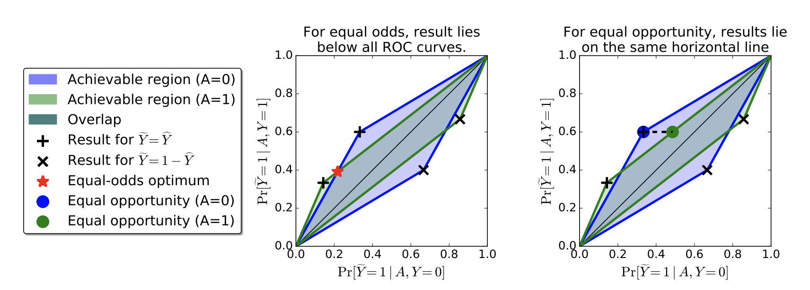

### 3.3 post processing optimisation

Problems of above methods:

> *fairness through unawareness*:  Ineffective, Ignoring sensitive attributes (protected features can be predicted from other features)
>
> *demographic parity*:  $$P(\hat{Y}=1\mid A=0) = P(\hat{Y}=1\mid A=1)$$. This method may accept qualified applicants in group $$A=0$$ but unqualified applicants in group $$A=1$$. Also, this method would not allow ideal predictor $$\hat{Y}=Y$$.

Training set: samples from distribution of $$(X,A,Y)$$.

Predictor: $$\hat{Y}(X)$$

Some definitions:

> Equalised odds:
>
> ​                                          $$P(\hat{Y}=1\mid A=0,Y=y) = P(\hat{Y}=1\mid A=1,Y=y), y\in\{0,1\}$$
>
> $$\hat{Y}$$ depends on $$A$$ only through $$Y$$.

> Equal opportunity:
>
> ​										$$P(\hat{Y}=1 \mid A=0,Y=1) = P(\hat{Y}\mid A=1,Y=1)$$.
>
>  \* weaker version of equalised odds. (Sometimes people care more about true positive rate)

This method tried to adjust posteriors that satisfies fairness constraints. The idea is to find a proper threshold of original score function.

The threshold value can be found by ROC curve of two groups. Equalised odds as shown in left graph, the threshold shown in left graph is only when ROC curve of both groups intersects. Equal opportunity is a relax version of equal odds, it can be achieved by satisfying same true positive rate of two groups (right graph).

- Zemel et al., [*Learning Fair Representations*]( https://www.cs.toronto.edu/~toni/Papers/icml-final.pdf), 2013 ICML.

- MB Zafar et al., [*Fairness Constraints: Mechanisms for Fair Classification*](https://arxiv.org/pdf/1507.05259.pdf), 2017 AISTATS.
