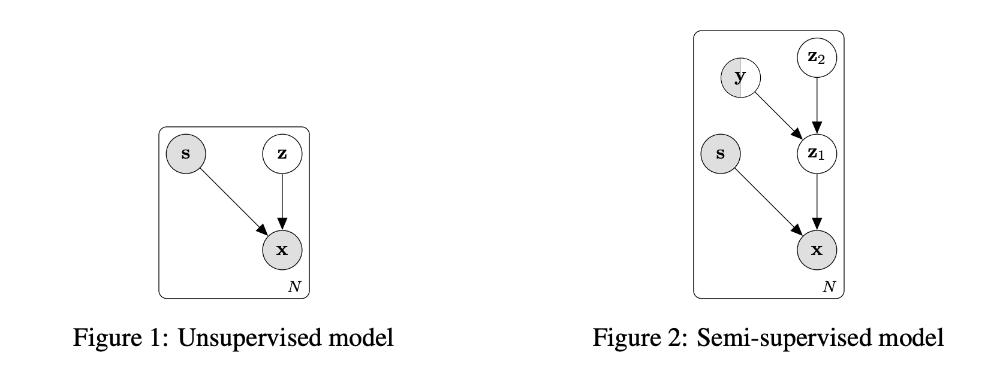

### Variational Fair Autoencoder

The intuitive idea is to learn fair representations by extracting the most informative hidden factors $$\mathbf{z}$$ and removing uninformative factors (sensitive information or nuisance variables $$\mathbf{s}$$). So the target is to separate $$\mathbf{z}$$ and $$\mathbf{s}$$ from the data. We can do this by using a factorised priors $$p(\mathbf{s})p(\mathbf{z})$$ (this means independent). However, some dependencies may still remain (via variational posterior $$q(\mathbf{z}\mid\mathbf{x},\mathbf{s})$$). Thus the authors use "Maximum Mean Discrepancy" to penalise differences between all order moments of the marginal posterior distribution $$q(\mathbf{z}\mid \mathbf{s}=k)$$ and $$q(\mathbf{z}\mid\mathbf{s}=k')$$.

**1. Unsupervised model**

(Label is not involved in this unsupervised model)

VAE architecture:

**Encoder**

Input: $$\mathbf{x}$$ and $$\mathbf{s}$$

Variational posterior of encoder is $$q_\phi(\mathbf{z}\mid\mathbf{x},\mathbf{s})$$, parameters $$\phi$$

**Decoder**

Input: $$\mathbf{z}$$ and $$\mathbf{s}$$

Conditional probability of decoder is $$p_\theta(\mathbf{x}\mid \mathbf{z},\mathbf{s})$$, parameters $$\theta$$

The likelihood is given by:

$$p_\theta(\mathbf{x}\mid\mathbf{s}) = \int p_\theta(\mathbf{z})p_\theta(\mathbf{x}\mid\mathbf{z},\mathbf{s})d\mathbf{z}$$

We want to resolve the dependencies between $$\mathbf{x}$$ and $$\mathbf{s}$$, but the likelihood is intractable.

Work with the log  likelihood to equip encoder and decoder. By choosing $$q_\phi(\mathbf{z}\mid \mathbf{x},\mathbf{s})$$ as Gaussian posterior and standard isotropic Gaussian prior $$p(\mathbf{z})=\mathcal{N}(0,\mathbf{I})$$.

$$\begin{align}&\sum^N_{n=1}\log p(\mathbf{x}_n\mid\mathbf{s}_n)\\ &=\sum^N_{n=1}\mathbb{E}_{\mathbf{z}_n\sim q_\phi(\mathbf{z}_n\mid\mathbf{x_n},\mathbf{s_n})}[\log p_\theta(\mathbf{x}_n\mid \mathbf{s}_n)]\\&= \sum^N_{n=1}\mathbb{E}_{\mathbf{z}_n}[\log \frac{p_\theta(\mathbf{x}_n\mid \mathbf{s_n},\mathbf{z_n})p_\theta(\mathbf{z})}{p_\theta(\mathbf{z}_n\mid \mathbf{x}_n,\mathbf{s}_n)}] \\ &= \sum^N_{n=1}\mathbb{E}_{\mathbf{z}_n}[\log \frac{p_\theta(\mathbf{x}_n\mid \mathbf{s_n},\mathbf{z_n})p_\theta(\mathbf{z})}{p_\theta(\mathbf{z}_n\mid \mathbf{x}_n,\mathbf{s}_n)}\frac{q_\phi(\mathbf{z}_n\mid\mathbf{x_n},\mathbf{s_n})}{q_\phi(\mathbf{z}_n\mid\mathbf{x_n},\mathbf{s_n})}]\\ &=\sum^N_{n=1}\mathbb{E}_{\mathbf{z}_n}[\log p_\theta(\mathbf{x}_n\mid \mathbf{s}_n,\mathbf{z}_n)]- \mathbb{E}_{\mathbf{z}_n}[\log \frac{q_\phi(\mathbf{z}_n\mid\mathbf{x}_n,\mathbf{s}_n)}{p_\theta(\mathbf{z})}]+ \mathbb{E}_{\mathbf{z}_n}[\log \frac{q_\phi(\mathbf{z}_n\mid \mathbf{x_n},\mathbf{s}_n)}{p_\theta(\mathbf{z}_n\mid \mathbf{x_n},\mathbf{s}_n)}] \\ &=\sum^N_{n=1}\mathbb{E}_{\mathbf{z}_n}[\log p_\theta(\mathbf{x}_n\mid \mathbf{s}_n,\mathbf{z}_n)]-KL(q_\phi(\mathbf{z}_n\mid\mathbf{x}_n,\mathbf{s}_n)||p_\theta(\mathbf{z}))+KL(q_\phi(\mathbf{z}_n\mid \mathbf{x_n},\mathbf{s}_n)||p_\theta(\mathbf{z}_n\mid \mathbf{x_n},\mathbf{s}_n))\end{align}$$

Because $$KL(q_\phi(\mathbf{z}_n\mid \mathbf{x_n},\mathbf{s}_n)||p_\theta(\mathbf{z}_n\mid \mathbf{x_n},\mathbf{s}_n))) \ge 0$$

$$\sum^N_{n=1}\log p(\mathbf{x}_n\mid\mathbf{s}_n)  \ge\sum^N_{n=1}\mathbb{E}_{\mathbf{z}_n}[\log p_\theta(\mathbf{x}_n\mid \mathbf{s}_n,\mathbf{z}_n)]-KL(q_\phi(\mathbf{z}_n\mid\mathbf{x}_n,\mathbf{s}_n)||p_\theta(\mathbf{z}))$$

We denote the ELBO as $$\mathcal{F}(\phi,\theta;\mathbf{x}_n,\mathbf{s}_n)$$

We choose the variational posterior to be Gaussian:

$$q_\phi(\mathbf{z}_n\mid\mathbf{x}_n,\mathbf{s}_n) = \mathcal{N}(\mathbf{z}_n\mid\mathbf{\mu}_n = f_\phi(\mathbf{x}_n,\mathbf{s}_n),\mathbf{\sigma}_n=e^{f_\phi(\mathbf{x}_n,\mathbf{s}_n)})$$

and

$$p_\theta(\mathbf{x}_n\mid \mathbf{s}_n,\mathbf{z}_n) = f_\theta(\mathbf{s}_n,\mathbf{z}_n)$$

**2. Semi-supervised model**

Sometimes when $$\mathbf{s}$$ and $$\mathbf{y}$$ are correlated, unsupervised way would yield random representations with respect to $$\mathbf{y}$$. Thus, the authors inject label information into the model (by adding a second layer incorporate with label information and invariant hidden features $$\mathbf{z}_1$$). We denote $$\mathbf{z}_2$$ to represent latent information which encodes the variation on $$\mathbf{z}_1$$ that is not explained by $$\mathbf{y}$$.

The process now becomes:

$$\mathbf{y},\mathbf{z}_2 \sim \text{Cat}(\mathbf{y})P(\mathbf{z}_2)$$
$$\mathbf{z}_1 \sim P_{\theta}(\mathbf{z}_1 \mid \mathbf{z}_2, \mathbf{y})$$
$$\mathbf{x} \sim P_{\theta}(\mathbf{x} \mid \mathbf{z}_1, \mathbf{s})$$

Posterior now becomes: $$q_{\phi}(\mathbf{z}_1,\mathbf{z}_2,\mathbf{y} \mid \mathbf{x},\mathbf{s})$$

and,

$$\begin{align} q_{\phi}(\mathbf{z}_{1n},\mathbf{z}_{2n},\mathbf{y}_n \mid \mathbf{x}_n,\mathbf{s}_n) &= q_{\phi}(\mathbf{z}_{2n},\mathbf{y}_n \mid \mathbf{z}_{1n},\mathbf{x}_n,\mathbf{s}_n)q_{\phi}(\mathbf{z}_{1n}\mid \mathbf{x}_n, \mathbf{s}_n)\\ &= q_{\phi}(\mathbf{z}_{2n} \mid \mathbf{z}_{1n},\mathbf{y}_n)q_{\phi}(\mathbf{y}_n \mid \mathbf{z}_{1n})q_{\phi}(\mathbf{z}_{1n}\mid \mathbf{x}_{n},\mathbf{s}_n) \end{align}$$

The lower bound:

Remember that ELBO can be expressed as Likelihood + Prior - approximation posteriors. Thus we can easily write the new ELBO:

$$\begin{align} \sum^N_{n=1}\log p(\mathbf{x}_n\mid\mathbf{s}_n)  \ge\sum^N_{n=1}\mathbb{E}_{q_\phi({\mathbf{z}_1}_n,{\mathbf{z}_2}_n,\mathbf{y}_n\mid \mathbf{x}_n,\mathbf{s}_n)}[\log p(\mathbf{z}_2)p(\mathbf{y}_n)+&\log p_\theta({\mathbf{z}_1}_n\mid {\mathbf{z}_2}_n,\mathbf{y}_n)p_\theta(\mathbf{x}_n\mid{\mathbf{z}_1}_n,\mathbf{s}_n)\\-\log q_\phi((\mathbf{z}_{1n},\mathbf{z}_{2n},\mathbf{y}_n \mid \mathbf{x}_n,\mathbf{s}_n))] \end{align}$$

$$\begin{align} \sum^N_{n=1}\log p(\mathbf{x}_n\mid\mathbf{s}_n)  \ge\sum^N_{n=1}\mathbb{E}_{q_\phi({\mathbf{z}_1}_n,{\mathbf{z}_2}_n,\mathbf{y}_n\mid \mathbf{x}_n,\mathbf{s}_n)}[\log p(\mathbf{z}_2) +\log p(\mathbf{y}_n)+&\log p_\theta({\mathbf{z}_1}_n\mid {\mathbf{z}_2}_n,\mathbf{y}_n) + \log p_\theta(\mathbf{x}_n\mid{\mathbf{z}_1}_n,\mathbf{s}_n)\\-\log q_\phi((\mathbf{z}_{1n},\mathbf{z}_{2n},\mathbf{y}_n \mid \mathbf{x}_n,\mathbf{s}_n))] \end{align}$$

A semi-supervised case (some labels are missing.....):

If the labels are observed:

$$\begin{align}\sum^N_{n=1} \mathcal{L}_\mathbf{s}(\phi,\theta;\mathbf{x}_n,\mathbf{s}_n,\mathbf{y}_n)= \sum^{N_s}_{n=1}\mathbb{E}_{q_\phi ({\mathbf{z}_1}_n\mid \mathbf{x}_n,\mathbf{s}_n)}[\log p_\theta(\mathbf{x}_n\mid {\mathbf{z}_1}_n,\mathbf{s}_n)-KL(q_\phi({\mathbf{z}_2}_n\mid{\mathbf{z}_1}_n,\mathbf{y}_n)||p(\mathbf{z}_2))]\\ +\mathbb{E}_{q_\phi({\mathbf{z}_1}_n\mid \mathbf{x}_n,\mathbf{s}_n)q_\phi({\mathbf{z}_2}_n\mid {\mathbf{z}_1}_n,\mathbf{y}_n)}[\log p_\theta({\mathbf{z}_1}\mid {\mathbf{z}_2}_n,\mathbf{y}_n)-\log q_\phi({\mathbf{z}_1}_n\mid \mathbf{x}_n,\mathbf{s}_n)] \end{align}$$

If the labels are not observed:

$$\begin{align}\sum^M_{m=1} \mathcal{L}_\mathbf{u}(\phi,\theta;\mathbf{x}_m,\mathbf{s}_m)= \sum^{M}_{m=1}\mathbb{E}_{q_\phi ({\mathbf{z}_1}_m\mid \mathbf{x}_m,\mathbf{s}_m)}[\log p_\theta(\mathbf{x}_m\mid {\mathbf{z}_1}_m,\mathbf{s}_m)-KL(q(\mathbf{y}_m\mid{\mathbf{z}_1}_m)||p(\mathbf{y}_m))]\\ +\mathbb{E}_{q_\phi({\mathbf{z}_1}_m,\mathbf{y}_m\mid \mathbf{x}_m,\mathbf{s}_m)}[-KL(q_\phi({\mathbf{z}_2}_m\mid{\mathbf{z}_1}_m,\mathbf{y}_m)||p(\mathbf{z}_2))]\\+ \mathbb{E}_{q_\phi({\mathbf{z}_1}_m,\mathbf{y}_m,{\mathbf{z}_2}_m\mid \mathbf{x}_m,\mathbf{s}_m)}[\log p_\theta({\mathbf{z}_1}_m\mid{\mathbf{z}_2}_m,\mathbf{y}_m)-\log q_\phi({\mathbf{z}_1}_m\mid{\mathbf{x}}_m,\mathbf{s}_m)]\end{align}$$

The final objective function is:

$$\mathcal{F}_{\text{VAE}}(\phi,\theta;\mathbf{x}_n,\mathbf{x}_m,\mathbf{s}_n,\mathbf{s}_m,\mathbf{y}_n) = \sum^N_{n=1} \mathcal{L}_\mathbf{s}(\phi,\theta;\mathbf{x}_n,\mathbf{s}_n,\mathbf{y}_n) +\sum^M_{m=1} \mathcal{L}_\mathbf{u}(\phi,\theta;\mathbf{x}_m,\mathbf{s}_m)+\alpha\sum^N_{n=1}\mathbb{E}_{q({\mathbf{z}_1}_n\mid \mathbf{x}_n,\mathbf{s}_n)[\log q_\phi(\mathbf{y}_n\mid {\mathbf{z}_1}_n)]} $$

By maximising the lower bound above, we might still get some information leakage from $$\mathbf{s}$$ due to the approximate marginal posterior $$q_\phi(\mathbf{z}_1\mid \mathbf{s})$$. To solve this, we could add regularisation on this marginal posterior through Maximum Mean Discrepancy.

$$\mathcal{F}_{\text{VFAE}}(\phi,\theta;\mathbf{x}_n,\mathbf{x}_m,\mathbf{s}_n,\mathbf{s}_m,\mathbf{y}_n)=\mathcal{F}_{\text{VAE}}(\phi,\theta;\mathbf{x}_n,\mathbf{x}_m,\mathbf{s}_n,\mathbf{s}_m,\mathbf{y}_n) -\beta\mathcal{\ell}_{\text{MMD}}({\mathbf{Z}_1}_{s=0},{\mathbf{Z}_1}_{s=1})  $$

where:

$$\ell_{\text{MMD}}({\mathbf{Z}_1}_{s=0},{\mathbf{Z}_1}_{s=1})=||\mathbb{E}_{\tilde{p}(\mathbf{x}\mid\mathbf{s}=0)}[\mathbb{E}_{q(\mathbf{z}_1\mid \mathbf{x},\mathbf{s}=0)}[\psi(\mathbf{z}_1)]]-\mathbb{E}_{\tilde{p}(\mathbf{x}\mid\mathbf{s}=1)}[\mathbb{E}_{q(\mathbf{z}_1\mid \mathbf{x},\mathbf{s}=1)}[\psi(\mathbf{z}_1)]]||^2$$

Original paper: [Louizos et al. ICLR2016](https://arxiv.org/pdf/1511.00830.pdf)
